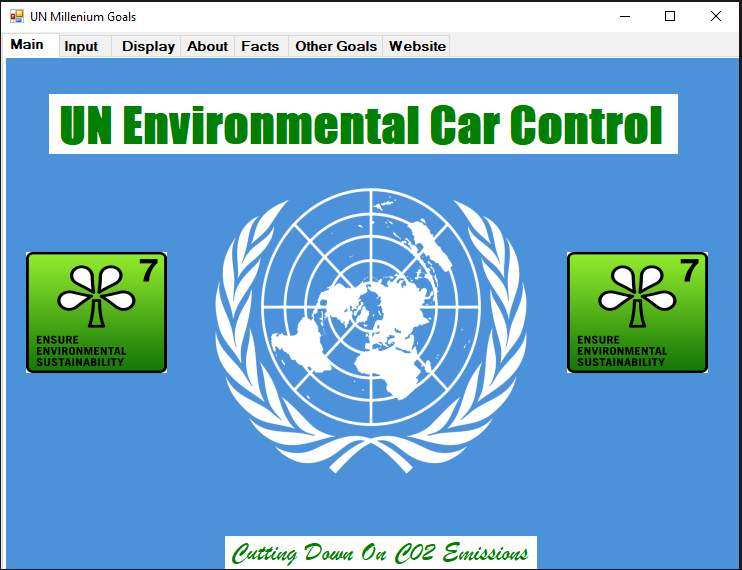
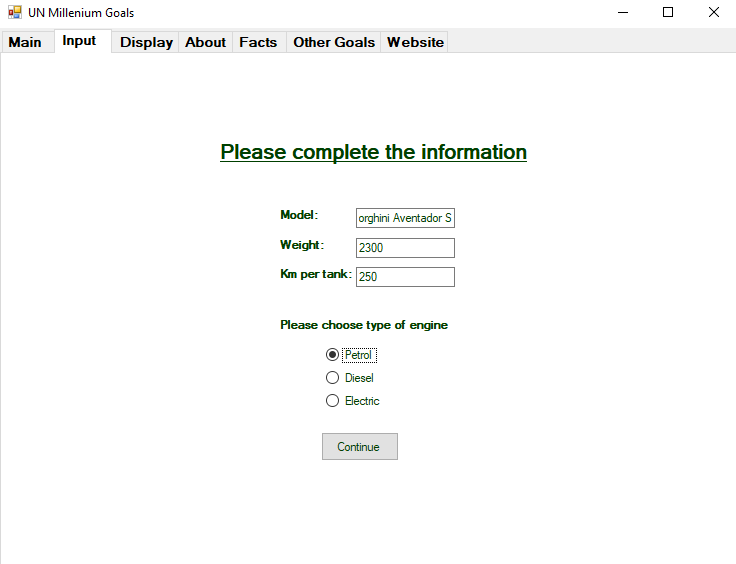
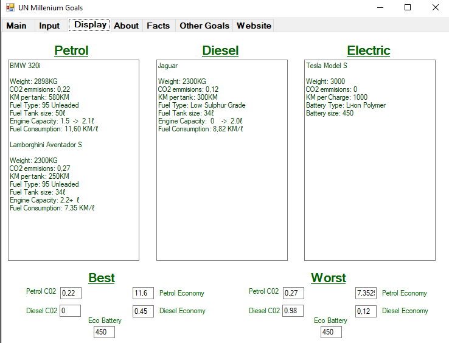
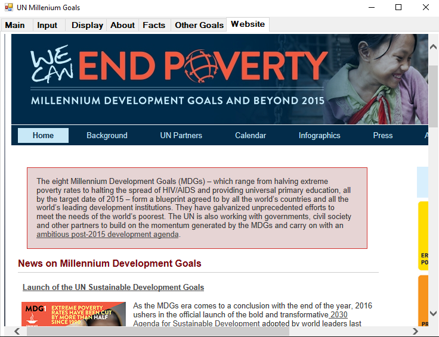

# UN-Sustainability-Emissions

Visual Basic application to adress the UN goal of sustainablity by working out car emissions and comparing them to other data as well as assessing them

# How to use 

- Users will enter a car as well as vehicle characterics to get a detailed view on how good or bad the vehicle is for the envirnment.
- A detailed analysis as well as comparing tools will be provided.

# Screenshots

- 

- 

-

- 

